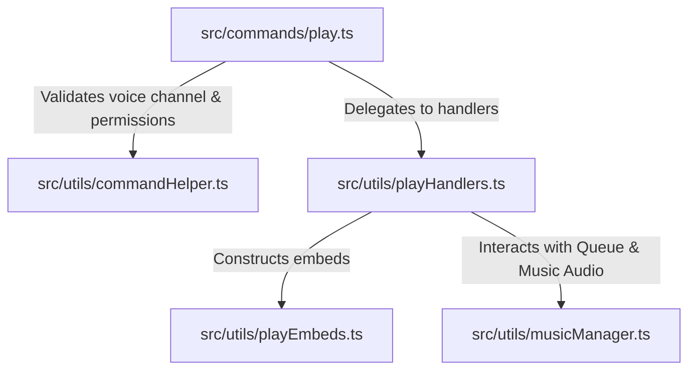

# XyBeat Codebase Refactoring & Modularization

This document outlines the recent architectural improvements made to the codebase, specifically targeting the `/play` command, voice validation, download status reporting, and general code cleanliness.

## Table of Contents
- [XyBeat Codebase Refactoring \& Modularization](#xybeat-codebase-refactoring--modularization)
  - [Table of Contents](#table-of-contents)
  - [Overview \& Objectives](#overview--objectives)
  - [New Codebase Architecture](#new-codebase-architecture)
  - [Component Breakdown](#component-breakdown)
    - [1. Voice \& Command Helpers: `src/utils/commandHelper.ts`](#1-voice--command-helpers-srcutilscommandhelperts)
    - [2. Download Progress UI: `src/utils/playEmbeds.ts`](#2-download-progress-ui-srcutilsplayembedsts)
    - [3. Command Handling Logic: `src/utils/playHandlers.ts`](#3-command-handling-logic-srcutilsplayhandlersts)
    - [4. Play Command Entry Point: `src/commands/play.ts`](#4-play-command-entry-point-srccommandsplayts)
  - [Best Practices Applied](#best-practices-applied)
  - [Validation \& Verifications](#validation--verifications)

---

## Overview & Objectives

The primary goals of this refactor were:
- **Modularization**: Shrinking massive source files by extracting helper logic into dedicated modules.
- **Dry (Don't Repeat Yourself) Principles**: Creating unified validator utilities to prevent redundant permission check boilerplate across audio commands.
- **Maintainability**: Separating Discord UI creation (Embeds) from core logic handlers.
- **Code Clarity**: Eliminating complex nested `if` statements in favor of cleaner, early-exit control flows.

---

## New Codebase Architecture

The helper functions previously embedded directly inside `src/commands/play.ts` have been separated into focused files inside `src/utils/`:

---

## Component Breakdown

### 1. Voice & Command Helpers: `src/utils/commandHelper.ts`
Holds shared validation routines to verify voice state matching and permissions across all music commands (`play`, `pause`, `stop`, `skip`, `resume`, `leave`, etc.):
* **`validateVoiceConnection(interaction, requireActiveQueue)`**:
  - Checks if the user is in a voice channel.
  - Ensures the user is in the same voice channel as the bot if a queue is already active.
* **`validateBotPermissions(voiceChannel, interaction)`**:
  - Ensures the bot has the correct permissions (`Connect` and `Speak`) to join the target channel.

### 2. Download Progress UI: `src/utils/playEmbeds.ts`
Handles visual feedback for song downloading. Separating UI construction from commands keeps command files strictly focused on flow control:
* **`createProgressBar(percentage)`**: Returns a string representation of a loading bar (e.g., `██████░░░░░░`).
* **`createProgressEmbed(title, progress)`**: Renders downloading stats (speed, total size, percentage, and ETA) or displays instant caching states when a song is already downloaded.

### 3. Command Handling Logic: `src/utils/playHandlers.ts`
Contains the business logic workflow of the play command:
* **`resolveQuery(query, interaction)`**: Decides whether the user input is a direct YouTube URL or searches YouTube and returns the first result.
* **`setupDownloadProgressCallback(guildId, title, interaction)`**: Registers rate-limited callbacks to update the downloading message in real time without triggering Discord API rate limits.
* **`handlePlaylist(url, interaction, voiceChannel)`**: Manages batch playlist extraction, queuing, and playlist embed responses.
* **`handleSingleVideo(url, interaction, voiceChannel)`**: Handles metadata lookup and queue insertions for single tracks.

### 4. Play Command Entry Point: `src/commands/play.ts`
The main play command file is now reduced from over **490 lines to less than 100 lines**. It acts purely as the command coordinator:
1. Validates voice connections and permissions.
2. Defers the interaction reply.
3. Sanitizes user input queries.
4. Resolves the track URL.
5. Invokes either the playlist handler or single video play handler.

---

## Best Practices Applied

* **Flat Code Style (Early Exits)**: Avoided nested `if` statements. Errors and validation failures exit the function execution immediately, resulting in cleaner, linear code.
* **TypeScript Integrity**: Ensured proper guild-bound typing guards are implemented to prevent potential `null` or `undefined` runtime errors with Discord interactions.
* **Strict Type Mapping**: Imported clean type contracts (`MinimalTextChannel` and `Song` interface) instead of casting objects blindly.

---

## Validation & Verifications

To ensure this refactor did not introduce regression bugs, we verified the codebase using:
1. **Compilation**: `npm run build` runs `tsc` and confirms that all TypeScript type annotations compile correctly.
2. **Linting**: `npm run lint` and `npm run format` verify that code styling meets the linting requirements without warnings.
